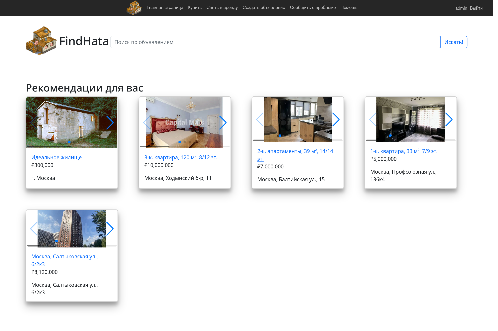
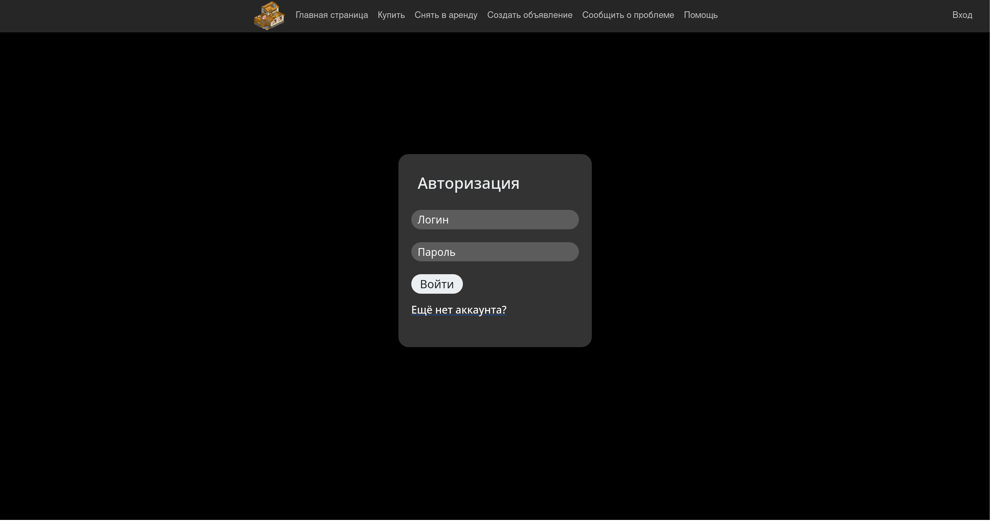
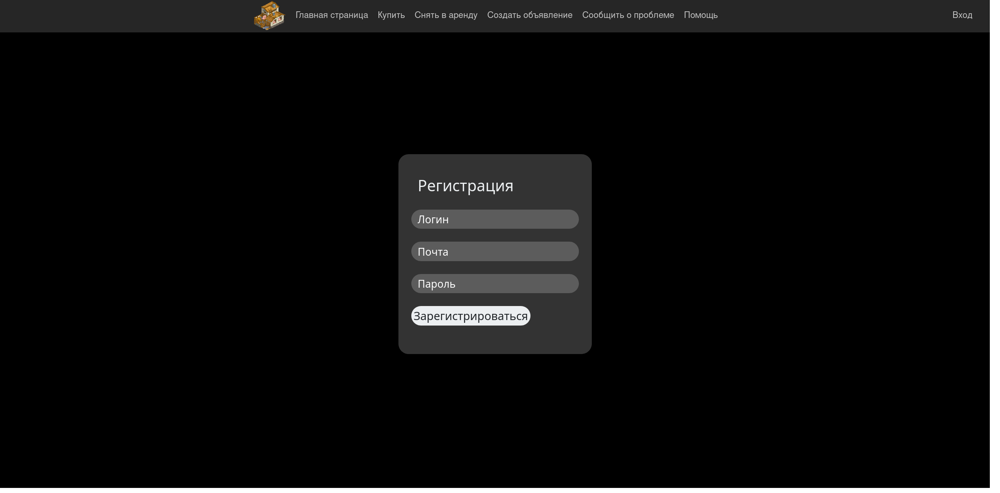
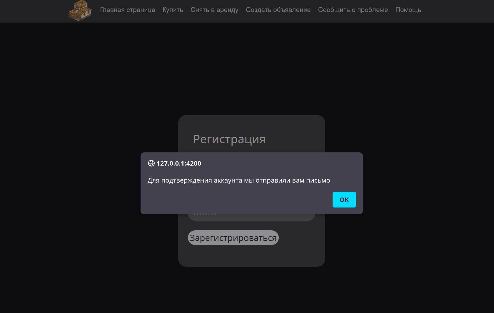
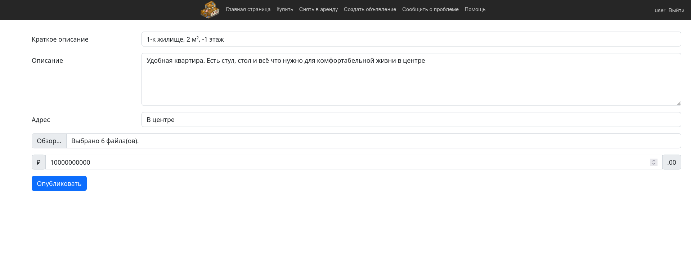
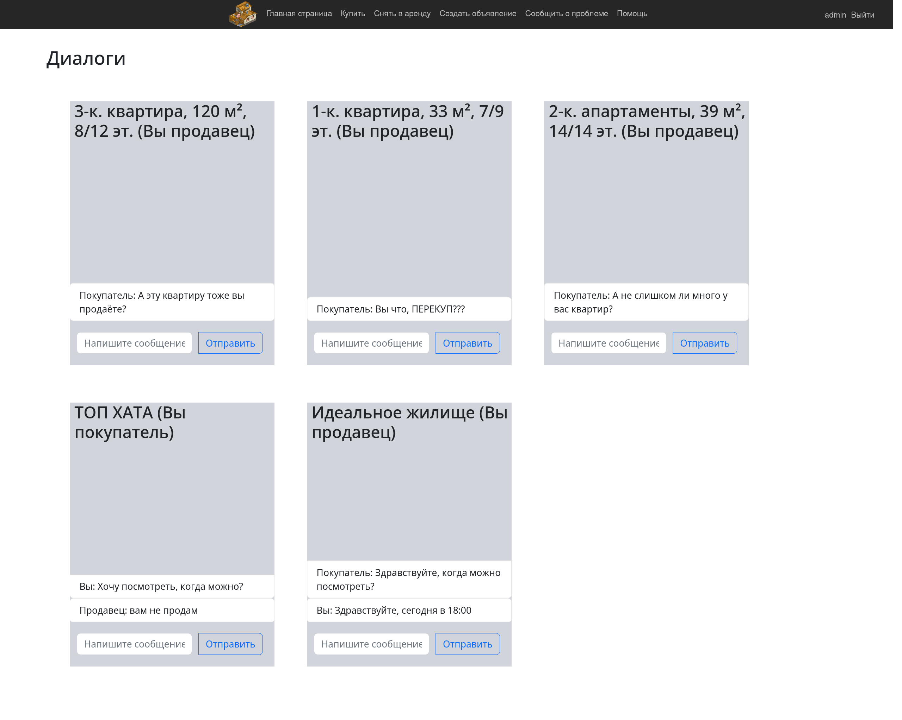

# FindHata
Приложение для поиска и размещения объявлений о недвижимости. 
Для добавления своего объявления пользователь может добавить описание своей недвижимости и приложить необходимые фотографии.
Для поиска подходящего объявления пользователю предлагается поисковая строка.

### Фунционал:
  - Регистрация на сайте
  - Подтверждение регистрации через почту
  - Добавление описания и фотографий к объявлению
  - Поиск объявлений по ключевому слову
  - Чат с мгновенными сообщениями между покупателем и продавцом
  - Автоматическая организация удалённого доступа к сайту через ngrok

### Требования:
  - Java 19 или новее
  - Установленный Docker и Docker compose

### Запуск:
Добавьте переменную окружения NGROK_AUTHTOKEN
```bash
export NGROK_AUTHTOKEN={{token}}
```
Запустите скрипт fullrestart
```bash
./fullrestart
```
В локальной сети сайт использует 5000 порт.

Внешний адрес сайта можно узнать через веб-интерфейс ngrok, который использует 4040 порт.

### Скриншоты

  - Главное меню



  - Страница входа



  - Страница регистрации





- Подтверждение почты


- Добавление объявления



- Использование поисковой строки


- Подробная информация об объявлении и чат с продавцом


- Чаты продавца с покупателями


